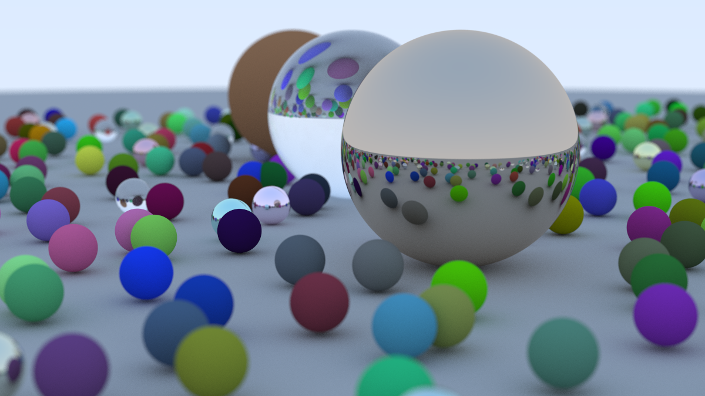

# rusty-ray-tracer 🦀
A ray tracer built from scratch in Rust, following Peter Shirley's [_Ray Tracing in One Weekend_](https://raytracing.github.io/books/RayTracingInOneWeekend.html). This is my port of the book's C++ implementation into idiomatic Rust - no rendering libraries, just math and rays.

## Final Render


## Features
- Custom `Vec3` / `Color` / `Point3` types with full operator overloading via Rust traits
- Ray-sphere intersection with surface normals and front/back face detection
- Three material types:
  - **Lambertian** - diffuse with random scatter
  - **Metal** - reflective with configurable fuzz
  - **Dielectric** - glass with Snell's law refraction and Schlick's approximation
- Positionable camera with configurable field of view, depth of field, and defocus blur
- Anti-aliasing via multi-sample averaging
- Recursive ray bouncing with configurable max depth
- Multithreaded rendering via `rayon` for near-linear speedup across CPU cores
- PNG image output via the `image` crate
- Render progress bar via `indicatif`

## How to Build and Run
Make sure you have Rust installed via [rustup](https://rustup.rs/), then:
```bash
git clone https://github.com/plasmaDestroyer/rusty-ray-tracer
cd rusty-ray-tracer
cargo run --release
```
> Please use `--release` - debug builds are dramatically slower for compute-heavy code like this.

The output is saved as `render.png` in the `output/` directory.

## Implementation Notes
Porting from C++ to Rust came with some interesting challenges:
- **No inheritance** - abstract base classes like `hittable` and `material` became Rust traits, with `Arc<dyn Hittable>` and `Arc<dyn Material>` replacing `shared_ptr`
- **Operator overloading** - implemented via `std::ops` traits (`Add`, `Mul`, `Neg`, etc.) instead of C++ operator syntax
- **Output parameters** - functions like `scatter()` and `hit()` return `Option<T>` instead of taking mutable output references, which is far cleaner
- **No implicit coercion** - every numeric cast is explicit, which caught a few subtle bugs early
- **`Copy` on `Vec3`** - since `Vec3` is just three `f64`s, deriving `Copy` eliminated a lot of borrow checker friction without any performance cost
- **Thread safety** - switching from `Rc` to `Arc` and adding `Send + Sync` bounds on trait objects was required to parallelize the render loop with `rayon`

## What's Next
- [x] Multithreading with `rayon`
- [x] PNG output with the `image` crate
- [x] Progress bar with `indicatif`
- [ ] _Ray Tracing: The Next Week_ - BVH, textures, lights, motion blur
